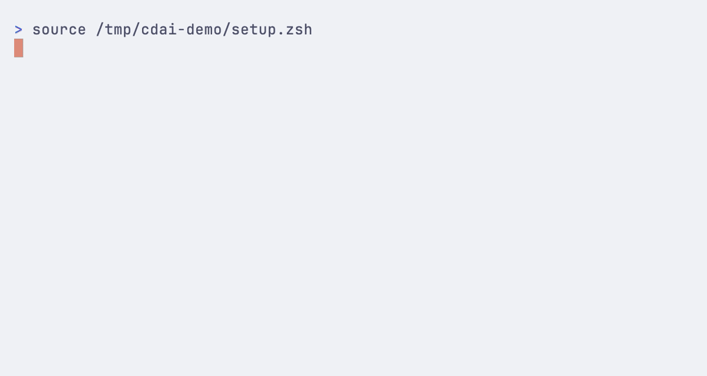

# cdai — cd with intent

[](https://github.com/franzenzenhofer/cdai/actions/workflows/ci.yml)

**Jump to the directory you mean—even if you have never visited it before.**

`cdai` keeps normal `cd` behavior, adds a local directory index and frecency, understands intent
such as `latest` or `2025`, and can use an optional AI fallback that is not allowed to invent a
path. The fast path and every Tab completion are deterministic and model-free.



The GIF runs the real completion, picker, AI validation, confirmation and alias paths. Its AI
backend is a deterministic local shim from `docs/demo-fixture.sh`, so the recording is repeatable
and never needs network access or model credentials. Re-record it with
`sh docs/demo-fixture.sh && vhs docs/demo.tape` (requires `vhs` and `fzf`).

## The 30-second version

```console
$ cdai pet<Tab>
$ cdai petalworks
→ ~/Dropbox/clients/petalworks

$ cdai latest petalworks folder
→ ~/Dropbox/clients/petalworks/petalworks-2026

$ cdai petalworks 2025
→ ~/Dropbox/clients/petalworks/petalworks-2025

$ cdai that client with the flowers
cdai: thinking... (apfel)
cdai: ~/Dropbox/clients/petalworks (petalworks = flowers-themed client name) [Y/n]
→ ~/Dropbox/clients/petalworks

# the confirmed wording is now a local, model-free alias
$ cdai that client with the flowers
→ ~/Dropbox/clients/petalworks
```

| Property | What cdai does |
|---|---|
| Native behavior | Tries your shell's real `cd` first; paths, flags, `cd -`, CDPATH and errors stay native |
| Cold directories | Indexes configured roots, so unvisited folders are searchable |
| Smart Tab | Completes prefixes, compact forms and bounded typos from local cached state |
| Common intent | Handles `latest`, `oldest`, years and `in <root>` without AI |
| Vague intent | Optionally asks an AI to choose from existing, pre-approved paths |
| Runtime footprint | One bundled Node 20+ executable, zero runtime npm dependencies |

## Install

Requires Node.js 20+ and zsh, Bash or Fish on macOS or Linux.

```bash
npm install -g github:franzenzenhofer/cdai
cdai setup
```

Add one line to your shell config, then start a new shell:

| Shell | Config file | Add this line |
|---|---|---|
| zsh | `~/.zshrc` | `eval "$(cdai init zsh)"` |
| Bash | `~/.bashrc` | `eval "$(cdai init bash)"` |
| Fish | `~/.config/fish/config.fish` | `cdai init fish \| source` |

```bash
exec "$SHELL"
cdai doctor
```

Coming from zoxide? `cdai import zoxide` seeds the local frecency database.

For non-interactive setup, consent is deliberately explicit:

```bash
cdai setup --root "$HOME/dev" --depth 3 --yes --no-ai
```

## Everyday usage

| You type | What happens |
|---|---|
| `cdai petal` | jump to the best name match, ranked by context and frecency |
| `cdai latest petalworks folder` | open the newest child directory, by modification time |
| `cdai oldest petalworks` | open the oldest child directory |
| `cdai petalworks 2025` | require `2025` somewhere in the matched path |
| `cdai squash in dev` | restrict the search to the matching configured root |
| `cdai -P petal` | resolve the match to its physical path, following symlinks |
| `cdai ~/some/dir` | use native `cd`; explicit paths are never guessed |
| `cdai -` | use native `cd -` to return to the previous directory |
| `cdai` | use native `cd` to return home |

## Smart Tab completion

Tab merges the shell's native directories and CDPATH with cdai's cached index, frecency, current
directory context and confirmed aliases.

```console
$ cdai gma<Tab>       # goalmap: compact subsequence
$ cdai petla<Tab>     # petalworks: bounded typo correction
$ cdai latest pet<Tab>
```

Prefix results may fan out, but a non-prefix correction must have one clear winner. Ambiguous or
unrelated text is left untouched. Duplicate names complete to the shared basename and are
disambiguated by the picker after Enter.

Tab reads local cached state only. It never calls AI, opens a picker, refreshes the index, ingests
history or crawls the filesystem.

## Native `cd` behavior and flags

The shell wrapper always gives native behavior the first chance:

- `cdai`, `cdai -`, explicit paths, CDPATH and zsh's `cd old new` substitution stay native.
- `-L` preserves the logical symlink path; `-P` resolves symlinks to the physical path. Both
  compose with intent in zsh/Bash, and Fish support is feature-detected by version.
- Stack syntax, late or invalid flags, and failed path-shaped input are never guessed.
- Existing local directories win even when their name is also a cdai command.
- Human messages go to stderr; `cdai query` reserves stdout for the resolved path.

Cache migrations happen automatically. After an upgrade, start a new shell to load the latest
wrapper; `cdai doctor` reports stale or partial state and the exact repair command.

## Command reference

```text
cdai [cd-options] <words> native cd first, then indexed/remembered/AI intent
cdai <explicit/path>      native cd only; never fuzzy or AI-rerouted
cdai query -- <words>     resolve only, prints the path on stdout
cdai init <zsh|bash|fish> print the shell integration, meant for eval
cdai setup [--yes] [--ai|--no-ai] [--root <path>] [--depth <1-64>]
           [--remove-root <path>]
                          detect or add roots and choose optional AI fallback
cdai index [--refresh]    show or rebuild the directory index
cdai import zoxide        seed frecency from an existing zoxide database
cdai alias list           show confirmed local intent aliases
cdai alias forget -- <words>
                          forget a mistaken confirmed alias
cdai doctor               show what cdai sees on this machine
cdai --version
```

Exit codes: `0` success, `3` a navigation choice was deliberately aborted, anything else is an
error. stdout carries the resolved path and nothing else; every human-readable byte goes to
stderr.

## Why this exists

I use [zoxide](https://github.com/ajeetdsouza/zoxide), and cdai deliberately uses the same
frecency formula. But frecency can only rank places already in its history. My awkward case is
the opposite: client and archive folders I may open once a year. The first jump is still manual.

cdai indexes only the roots you configure, then uses frecency to rank that known tree. That
makes a never-visited directory a first-class candidate.

| Capability | zoxide | cdai |
|---|---|---|
| frecency ranking | yes | yes, same aging formula |
| learns from your shell | yes | yes, prompt/PWD hook, no Node process on directory change |
| indexes directories you have never visited | no | yes, configurable roots and depth |
| `latest` / `oldest` / year / `in <root>` | no | yes, deterministic, no LLM |
| natural language fallback | no | optional, one config flag to kill it |
| runtime requirement | standalone binary | Node 20+; zero npm dependencies |
| cold jump on an unvisited folder | miss | hit |

Use zoxide if visited-directory frecency is the whole problem; it is mature, fast and ships as
a static binary. Use cdai if cold directories, deterministic intent and guarded natural-language
fallback are useful enough to justify a Node executable.

## The AI cannot hallucinate a directory

Giving an LLM arbitrary control of your working directory would be a terrible idea. cdai uses a
closed-set protocol instead:

1. The deterministic matcher supplies up to 30 fuzzy and 20 frecent existing paths.
2. The model may choose one exact path from that list, or decline.
3. cdai checks the answer against both the original list and the filesystem.
4. You confirm the first answer; only then can the wording become a local alias.

cdai emits its own trusted candidate, never the model's spelling. Even an existing path is
rejected if it was not offered.

That makes the failure mode boring on purpose. Two measured runs of the same query:

```console
# frecency db empty, no fuzzy candidates -> nothing to choose from
$ cdai that client with the flowers
cdai: no match for "that client with the flowers"
      try `cdai index --refresh`, or add a root with `cdai setup`

# same query, after petalworks is in the history
$ cdai that client with the flowers
cdai: thinking... (apfel)
cdai: ~/Dropbox/clients/petalworks (petalworks = flowers-themed client name) [Y/n]
```

The model is a re-ranker over a set you could print yourself, not a path generator. A missing
backend, timeout, malformed answer or chatty model degrades to fuzzy suggestions. Confirmed
answers are stored as bounded local aliases and revalidated before reuse; deterministic matching
still wins if the tree later gains a better direct match.

Corollary, stated plainly: cdai does **not** do semantic search over your whole disk. If the
directory is neither a fuzzy candidate nor recently used, no amount of LLM will find it.

## Measured performance

Measured on an Apple Silicon laptop (macOS 26, Node 25) against an index of about **2,500
directories**. Best of 10 runs, full process spawn to exit, `spawnSync` from a Node harness:

| | min | median |
|---|---|---|
| bare `node -e ""` (the floor) | 67ms | 73ms |
| `cdai <exact hit>` | 95ms | 105ms |
| `cdai latest <name>` | 95ms | 102ms |
| `cdai <no deterministic match>` (tier 2 fires) | 7.8s | 8.3s |

So tier 1 costs about **30ms of actual work**; the rest is Node booting. Tier 2 costs seconds,
which is exactly why the thresholds are tuned to avoid it. `test/latency.test.ts` fails the
build if the 10-run median crosses 150ms or p95 crosses 250ms for either an exact query or
cached Tab completion.

Reproduce with `npm run build && npx vitest run test/latency.test.ts`.

The v0.3.1 release suite covers 216 tests. CI runs on macOS and Linux with Node 20, 22 and 24;
real PTYs exercise Zsh, Bash, Fish 3.6 and Fish 4.8; a synthetic 50,000-entry index has its own
completion budget; and the packed tarball is installed and executed instead of testing only the
source tree.

## How it works

```
        cdai latest petalworks folder
                    │
                    ▼
        ┌───────────────────────┐
        │ tokenize              │  operators: latest/oldest, 2026, "in dev"
        │                       │  stopwords: folder, dir, the, project, go, to, my
        └───────────┬───────────┘
                    ▼
        ┌───────────────────────┐        ┌──────────────────┐
        │ tier 1: deterministic │◀───────│ index.json  dirs │  config-aware, TTL 60min
        │ fuzzy + frecency      │◀───────│ db + aliases     │  visits + confirmed intent
        └───────────┬───────────┘        └──────────────────┘
                    │
      score >= 550  │  2+ candidates       nothing convincing
      and gap >= 200│  >= 400              │
                    ▼         ▼            ▼
               ┌────────┐ ┌────────┐ ┌──────────────────────┐
               │  jump  │ │ picker │ │ tier 2: ai (optional)│ Apfel/Claude/Gemini/Ollama,
               │  exit 0│ │  fzf   │ │ exact offered path   │ 45s cap, bounded output,
               └────┬───┘ └───┬────┘ └──────────┬───────────┘ validated before use
                    ▼         ▼                 ▼
              stdout: /the/path        stderr: → ~/the/path
```

**Tier 1 is the product.** Every directory name gets a match class - exact 1000, prefix 800,
word boundary 600, substring 400, fuzzy up to 380 - plus `100 * log2(1 + frecency)` and a small
bonus for living under your current directory. All tokens must match (AND). A directory and its
own parent collapse into one answer, because they are the same place, not two options. Every
threshold in the diagram lives in one small file: [`src/match/constants.ts`](src/match/constants.ts).

## AI backends

On Apple Silicon with macOS 26+, `brew install apfel` adds a private, on-device fallback. It
uses Apple's system model and requires Apple Intelligence, but no API key or separate model
download.

The default `"command": "auto"` chooses the first installed backend in this order:

1. `apfel` - Apple's on-device Foundation Model; no model setting needed.
2. `claude` - Claude Code in print mode; defaults to `sonnet`.
3. `gemini` - Gemini CLI in headless mode; uses its configured default model.

Ollama is deliberately not guessed because cdai cannot know which local model you want. Select
it with a model name:

```json
{ "ai": { "enabled": true, "command": "ollama", "model": "qwen3:4b", "timeoutMs": 45000 } }
```

To pin a built-in backend, set `command` to `apfel`, `claude`, or `gemini`. Existing Claude
configs keep working unchanged. `args` adds backend-specific flags without invoking a shell.

Any other one-shot CLI also works. `command` is the executable name or path; each `args` entry
is one argument. `{prompt}` and `{model}` placeholders are expanded in place, and the prompt is
appended when `{prompt}` is absent:

```json
{
  "ai": {
    "enabled": true,
    "command": "my-ai",
    "args": ["run", "--model", "{model}", "--prompt", "{prompt}"],
    "model": "small",
    "timeoutMs": 45000
  }
}
```

cdai understands bare model JSON and the response envelopes emitted by Apfel, Claude, Gemini,
and OpenAI-compatible tools. Backend output is capped at 1 MiB, calls time out and terminate
the backend process group, control text is removed from displayed reasons, and every failure
falls back to deterministic suggestions.
Setup states which backend was selected and that vague queries plus candidate paths may be sent
to it. Use `cdai setup --no-ai` during or after setup to opt out, and `--ai` to re-enable it.

### Turning AI off entirely

Run `cdai setup --no-ai` (or set `ai.enabled` to `false`) and cdai is a fast fuzzy jumper with
frecency, operators, and any previously confirmed local aliases. Tier 1, Tab, and alias lookup
make no network call under any configuration. The full suite passes with no AI backend on
`PATH`; tier 2 tests drive executable shim scripts, so cloning this repo never spends a token.

The chosen backend receives the words you typed, your cwd, and up to 50 in-root directory
**paths** - never file contents. With Apfel or Ollama that stays local; cloud-backed CLIs apply
their own privacy and billing policies.

## Configuration

`~/.config/cdai/config.json` (override with `CDAI_CONFIG_DIR`, data with `CDAI_DATA_DIR`):

```json
{
  "roots": [
    { "path": "/Users/you/dev", "depth": 2 },
    { "path": "/Users/you/Dropbox/clients", "depth": 3 }
  ],
  "ignore": ["node_modules", ".git", "dist", "build", ".venv"],
  "ai": { "enabled": true, "command": "auto", "args": [], "model": "", "timeoutMs": 45000 }
}
```

Data lives in `~/.local/share/cdai/`: `index.json` (capped at 50,000 entries and a five-second
walk), `db.json` (frecency, capped at 10,000 paths), `aliases.json` (confirmed intent, capped at
256), and `visits.log` (append only, ingested transactionally on the next navigation query).
Config/state directories are mode `0700` and files `0600`; each invocation tightens permissions
from older installs. The index carries a roots/depth/ignore fingerprint, reports partial crawls,
and is rebuilt automatically when that configuration changes. Concurrent shells serialize
short atomic updates so visits and aliases are not lost or double-counted.

## Limitations

- **No Windows.** zsh, bash and fish on macOS and Linux.
- **The index is a snapshot**, rebuilt when configuration changes, an old uncertain query needs
  it, or a confident cached target vanished. A brand-new folder during the 60-minute TTL may
  still need `cdai index --refresh`.
- **Crawl depth is bounded** by your config (and capped at 64). Deep monorepos need a deeper
  root, and a deeper root means a bigger index.
- **Tier 2 is seconds, not milliseconds**, and needs a working CLI backend. It is off the hot
  path by design, not by accident.
- **No semantic search over unindexed directories.** See the section above.
- **Newline-bearing directory names are not supported.** Shell query/completion output is
  newline-delimited, so such paths are excluded instead of being emitted ambiguously.
- **Small TypeScript codebase.** This is one focused tool, not a platform.

## Development

```bash
npm run typecheck && npm run lint && npm run test && npm run build
```

No mocking library and no fake filesystem. Fixtures are real temp trees containing spaces,
unicode, symlinks, an unreadable directory and a `node_modules`. The AI tier uses executable
shim processes; zsh, Bash, older Fish, and current Fish run end to end, with real PTY Tab tests
for all three shells. Exact-query and cached-completion median/p95 latency remain hard build gates.
The packed tarball is installed and executed in the suite. Zero runtime dependencies; the build
is one bundled `dist/cdai.js`.

## Prior art

[zoxide](https://github.com/ajeetdsouza/zoxide) and [z](https://github.com/rupa/z) for frecency,
[fzf](https://github.com/junegunn/fzf) for the picker, [vhs](https://github.com/charmbracelet/vhs)
for the demo. cdai's only original claim is the combination: a crawled index so cold folders are
reachable, deterministic operators so common intent never needs a model, and an LLM confined to
re-ranking a closed candidate list.

## License

MIT
